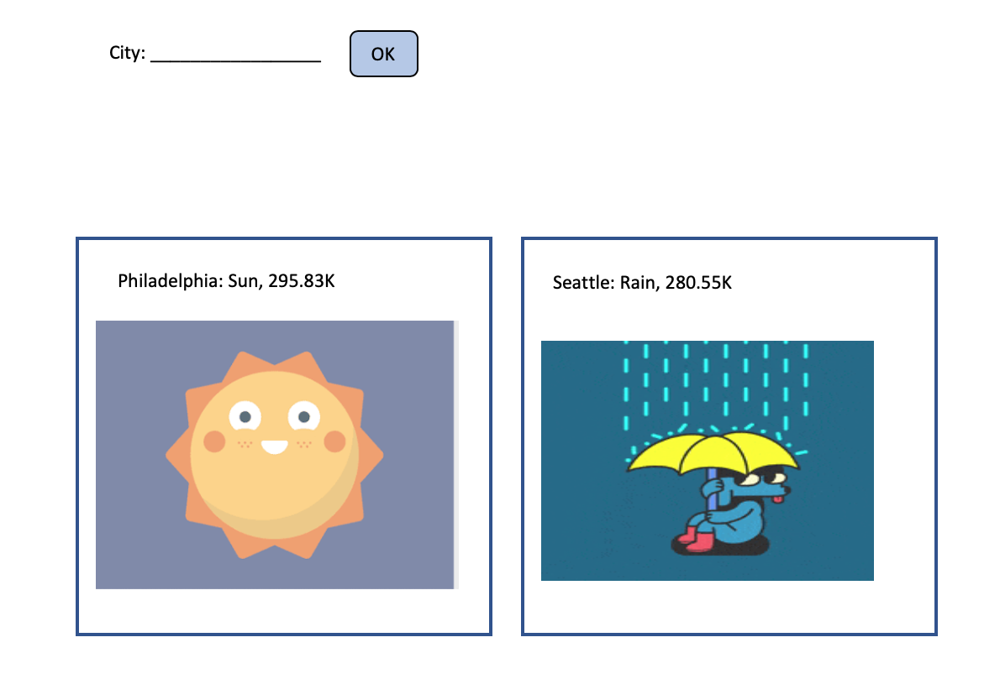

# CIS557-hw3: Fetch API + testing

## Instructions:
In this assignment, you will create and test a webapp that retrieves data from web APIs.
You will create:
- A single ***HTML document*** 
- A single ***CSS document*** 
- One or more ***JavaScript document(s)***. Use ***modules*** if you have more than one js file

## Setup:
- You will use http://api.openweathermap.org  to get weather data
- You will  use https://developers.giphy.com/docs/api/endpoint#search  to get gif image matching the weather
- Follow the instructions of the APIs to register and get an API key (if necessary).

## Specifications:
- The content of the webpage (not the CSS file) must be entirely created by your javascript code (HTML elements, events handling).  (15 points)
- The user should be able to perform and display the results of up to 5 queries at the same time (see example below). (5 points)
- Your app should retrieve weather data based on the city entered by the user. You must use the fetch API. (10 points)
- Your app should retrieve image/gif based on the current weather returned by the openweathermap API. You must use the fetch API.  For example if the forecast at a location is “rain”, then you should fetch a gif/image about rain(10 points)
- You must use closures when adding fetch results to your webpage. (10 points)

## Testing: (30 points)
- You should thoroughly test your webapp
- Your Jest unit tests should achieve the highest code coverage possible
- You should use selenium to automate your functional tests
- Link TravisCI with your GitHub repository
 
## Example: 
- The user entered two cities (one after the other) in this case Philadelphia then Seattle.
- When the user clicks on OK, a new div is added containing weather data and an image. The div containing Philadelphia information was added first then the one about Seattle
- Closures are used to create and display the weather div elements. 
____________________________________________________________________

____________________________________________________________________

## Validation: (20 points)
- Your JavaScript must be clean, readable, and ESLint warning-free.  You will use the Airbnb Javascript style. 
- Your HTML file(s) must pass validation at http://validator.w3.org.
- Your CSS files(s) must pass validation at http://www.css-validator.org/.
- You may not use jQuery or any other JavaScript library package in this assignment. The goal of this activity is to get comfortable with low-level foundational JavaScript/DOM features. You may, however, use any JavaScript built-in functions and the test libraries covered in class. 

## Submission:
- Do not forget to regularly commit your work to GitHub.
- Only the last push before the due date will be graded.

